---
## Front matter
title: Лабораторная работа № 1
subtitle: Установка и конфигурация операционной системы на виртуальную машину
author:
  - Жукова С. В. НПИбд-01-24
institute:
  - Российский университет дружбы народов, Москва, Россия
date: 5 марта 2024

## Formatting
toc: false
slide_level: 2
theme: metropolis
header-includes: 
 - \metroset{progressbar=frametitle,sectionpage=progressbar,numbering=fraction}
 - '\makeatletter'
 - '\beamer@ignorenonframefalse'
 - '\makeatother'
aspectratio: 43
section-titles: true
---

## Докладчик

:::::::::::::: {.columns align=center}
::: {.column width="70%"}

  * Жукова София Викторовна
  * студентка
  * направления прикладной информатика
  * Российский университет дружбы народов
  * [1032240966@pfur.ru](mailto:1032240966@pfur.ru)
  * <https://svzhukova.github.io/ru/>

:::
::: {.column width="30%"}

:::
::::::::::::::

# Вводная часть

Лабораторная работа Установка и конфигурация операционной системы на виртуальную машину

## Цель

Целью данной работы является приобретение практических навыков установки операционной системы на виртуальную машину, настройки минимально необходимых для дальнейшей работы сервисов.

# Выполнение лабораторной работы

## Скачаем образ диска с официального сайта 

{#fig-001 width=70%}

## Устанавливаем linux rocky на виртуальную машину 

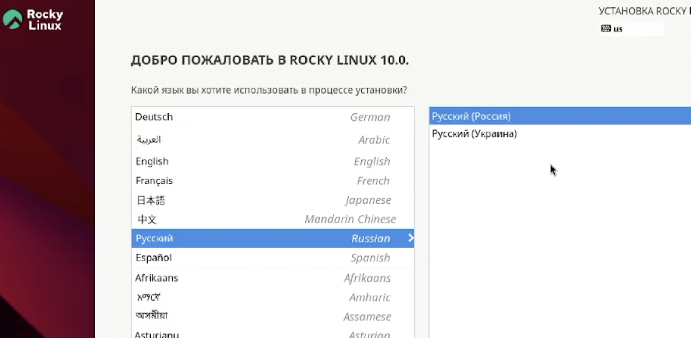{#fig-002 width=70%}

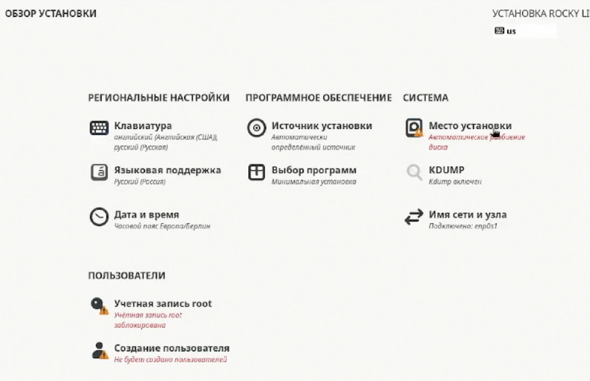{#fig-003 width=70%}

##  

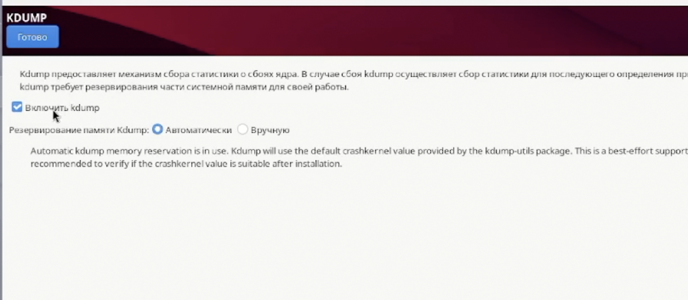{#fig-004 width=70%}

## Включим сетевое соединение и в качестве имени узла укажем user.localdomai 

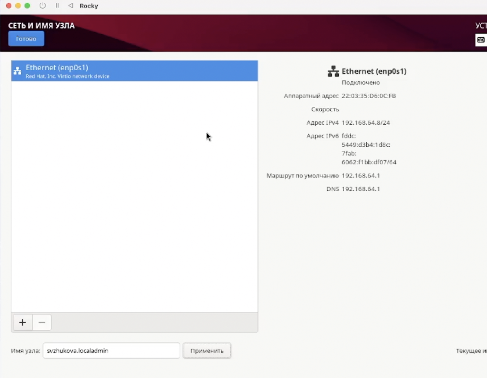{#fig-005 width=70%}

## Войдем в ОС под заданной вами при установке учётной записью.В терминале
виртуальной машины подключим образ диска дополнений гостевой ОС

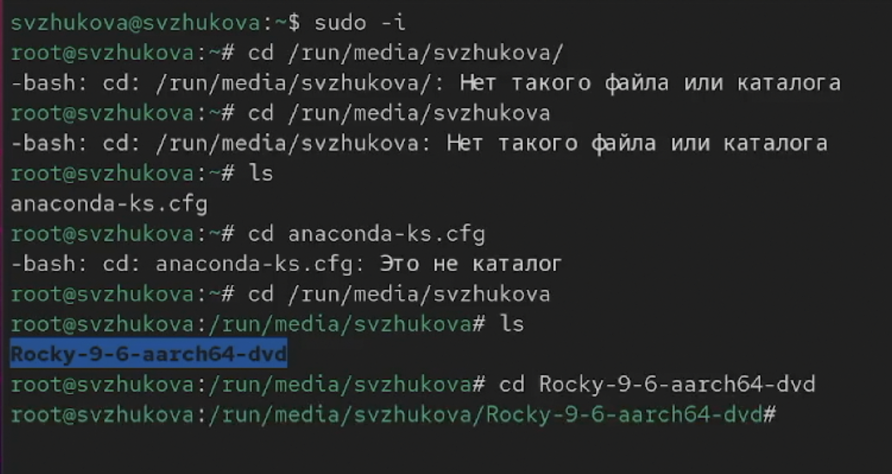{#fig-006 width=70%}

## Домашнее задание

Дождемся загрузки графического окружения и откроем терминал. В окне терминала проанализируем последовательность загрузки системы, выполнив команду dmesg.
##

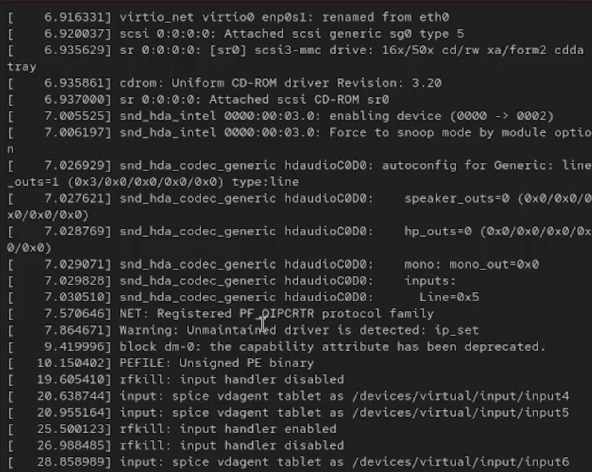{#fig-007 width=70%}

## Получим следующую информацию.

Версия ядра Linux (Linux version). 

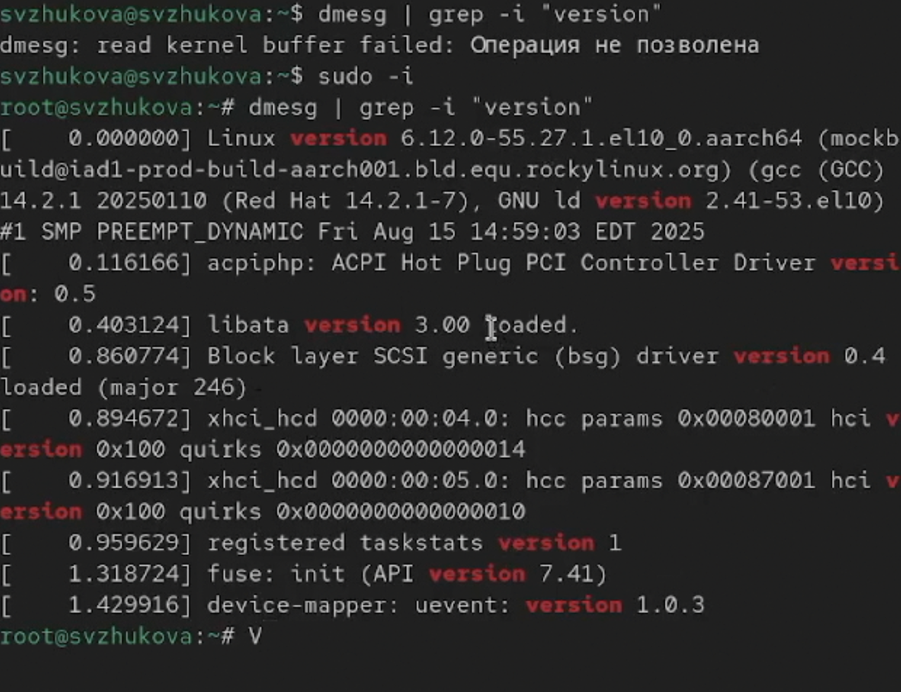{#fig-008 width=70%}

## Частота процессора (Detected Mhz processor)

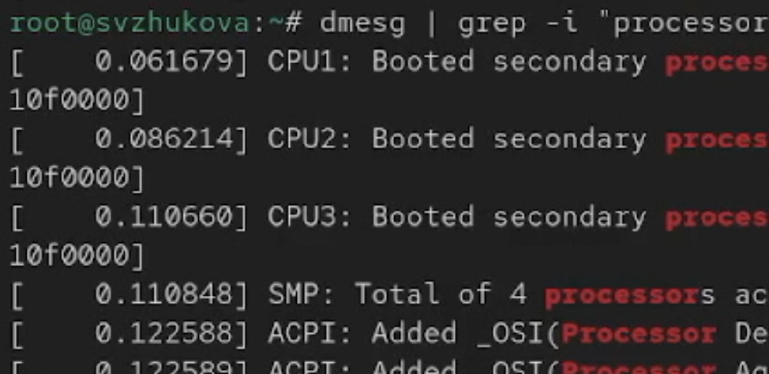{#fig-009 width=70%}

## Модель процессора (CPU0).

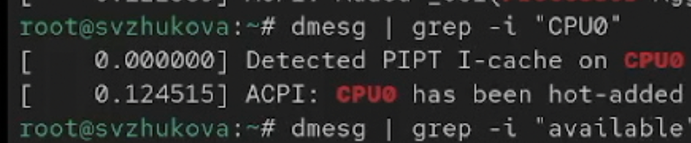{#fig-010 width=70%}

## Объем доступной оперативной памяти (Memory available). 

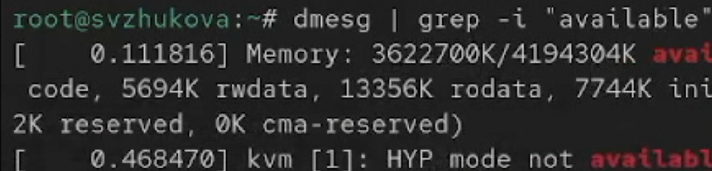{#fig-011 width=70%}

## Тип обнаруженного гипервизора (Hypervisor detected). 

{#fig-012 width=70%}

## Тип файловой системы корневого раздела.. (filesystem). 

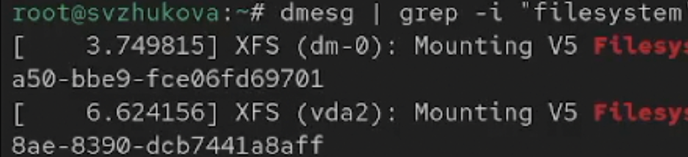{#fig-013 width=70%}

 Последовательность монтирования файловых систем: сначала dm0, потом vda2
 
# Заключение

Мы приобрели практические навыки установки операционной системы на виртуальную машину, настроили минимально необходимые для дальнейшей работы сервисы.
{ #fig:001 width=70% }

