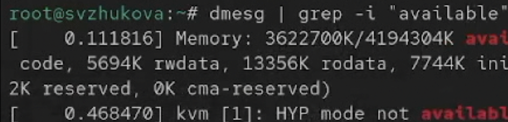

---
## Front matter
title: "Лабораторная работа № 1"
subtitle: "Установка и конфигурация операционной системы на виртуальную машину"
author: "Жукова София Викторовна"

## Generic otions
lang: ru-RU
toc-title: "Содержание"

## Bibliography
bibliography: bib/cite.bib
csl: pandoc/csl/gost-r-7-0-5-2008-numeric.csl

## Pdf output format
toc: true # Table of contents
toc-depth: 2
lof: true # List of figures
lot: true # List of tables
fontsize: 12pt
linestretch: 1.5
papersize: a4
documentclass: scrreprt
## I18n polyglossia
polyglossia-lang:
  name: russian
  options:
	- spelling=modern
	- babelshorthands=true
polyglossia-otherlangs:
  name: english
## I18n babel
babel-lang: russian
babel-otherlangs: english
## Fonts
mainfont: IBM Plex Serif
romanfont: IBM Plex Serif
sansfont: IBM Plex Sans
monofont: IBM Plex Mono
mathfont: STIX Two Math
mainfontoptions: Ligatures=Common,Ligatures=TeX,Scale=0.94
romanfontoptions: Ligatures=Common,Ligatures=TeX,Scale=0.94
sansfontoptions: Ligatures=Common,Ligatures=TeX,Scale=MatchLowercase,Scale=0.94
monofontoptions: Scale=MatchLowercase,Scale=0.94,FakeStretch=0.9
mathfontoptions:
## Biblatex
biblatex: true
biblio-style: "gost-numeric"
biblatexoptions:
  - parentracker=true
  - backend=biber
  - hyperref=auto
  - language=auto
  - autolang=other*
  - citestyle=gost-numeric
## Pandoc-crossref LaTeX customization
figureTitle: "Рис."
tableTitle: "Таблица"
listingTitle: "Листинг"
lofTitle: "Список иллюстраций"
lotTitle: "Список таблиц"
lolTitle: "Листинги"
## Misc options
indent: true
header-includes:
  - \usepackage{indentfirst}
  - \usepackage{float} # keep figures where there are in the text
  - \floatplacement{figure}{H} # keep figures where there are in the text
---

# Цель работы

Целью данной работы является приобретение практических навыков установки операционной системы на виртуальную машину, настройки минимально необходимых для
дальнейшей работы сервисов.

# Выполнение лабораторной работы

Скачаем образ диска с официального сайта ([рис. @fig-001]).

{#fig-001 width=70%}

Устанавливаем linux rocky на виртуальную машину ([рис. @fig-002]).

{#fig-002 width=70%}

 ([рис. @fig-003]).

{#fig-003 width=70%}

 ([рис. @fig-004]).

{#fig-004 width=70%}

Включим сетевое соединение и в качестве имени узла укажем user.localdomai ([рис. @fig-005]).

{#fig-005 width=70%}

Войдем в ОС под заданной вами при установке учётной записью.В терминале
виртуальной машины подключим образ диска дополнений гостевой ОС ([рис. @fig-006]).

{#fig-006 width=70%}

## Домашнее задание

Дождемся загрузки графического окружения и откроем терминал. В окне терминала проанализируем последовательность загрузки системы, выполнив команду dmesg.
 ([рис. @fig-007]).

{#fig-007 width=70%}

Получим следующую информацию.

Версия ядра Linux (Linux version). ([рис. @fig-008]).

{#fig-008 width=70%}

Частота процессора (Detected Mhz processor). ([рис. @fig-009]).

{#fig-009 width=70%}

Модель процессора (CPU0). ([рис. @fig-010]).

{#fig-010 width=70%}

Объем доступной оперативной памяти (Memory available). ([рис. @fig-011]).

{#fig-011 width=70%}

Тип обнаруженного гипервизора (Hypervisor detected). ([рис. @fig-012]).

{#fig-012 width=70%}

Тип файловой системы корневого раздела.. (filesystem). ([рис. @fig-013]).

{#fig-013 width=70%}

 Последовательность монтирования файловых систем: сначала dm0, потом vda2
 
# Выводы

Мы приобрели практические навыки установки операционной системы на виртуальную машину, настроили минимально необходимые для дальнейшей работы сервисы.

## Контрольные вопросы

1. **Команды терминала и примеры:**

   - **Получение справки по команде:** `man <команда>`, например, `man ls`.
   - **Перемещение по файловой системе:** `cd <путь_к_каталогу>`, например, `cd /home/user/Documents`.
   - **Просмотр содержимого каталога:** `ls [опции]`, например, `ls -l`.
   - **Определение объёма каталога:** `du -sh <каталог>`, например, `du -sh /home/user`.
   - **Создание / удаление каталогов / файлов:**
     - Создание: `mkdir <каталог>`, например, `mkdir new_folder`.
     - Удаление: `rm <файл>`, например, `rm file.txt`.
     - Удаление пустого каталога: `rmdir <каталог>`.
   - **Задание прав:** `chmod <права> <файл/каталог>`, например, `chmod 755 script.sh`.
   - **Просмотр истории команд:** `history`.

2. **Информация в учётной записи пользователя:** Она содержит имя пользователя, UID, GID, домашний каталог и оболочку. Команды для просмотра: `id`, `whoami`, `cat /etc/passwd`.

3. **Что такое файловая система?** Это структура, управляемая данными на дисках. Примеры: ext4 (для Linux), Btrfs (с поддержкой снапшотов), NTFS (Windows).

4. **Просмотр смонтированных файловых систем:** Используйте команды `df -h` или `mount`.

5. **Удаление зависшего процесса:** Используйте `kill <PID>`, а если не реагирует, `kill -9 <PID>` для принудительного завершения.

